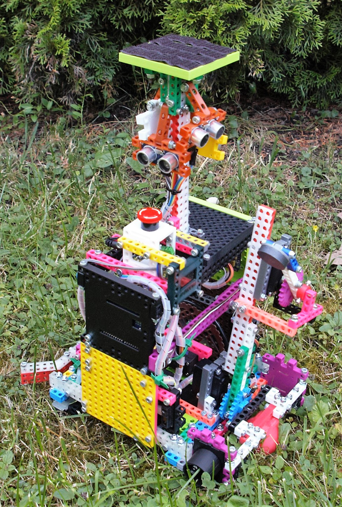

# Bit assistant

## Mission (impossible?)

The Roadside assistance contest is understood to be quite complicated and difficult.
Many robot creators think that a highly advanced control systems and algorithms, complicated electronics and mechanical design are needed to create a robot that can successfully attend this contest. Because of this there were not too many competitors to this contest to date.
We would like to change that and with our robot we want to present to the public that it can be done in a simple way.

Our goal is to build a robot from cheap and easily available components.
We want to build the robot as simple as possible yet potentially extensible to finish more tasks in the future.

## Robot

### Mechanical part

The robot construction is build exclusively from plastic 3D-printed parts connected with metal bolts and nuts.
These parts come from an open-hardware building kit called m-BITBEAM.
Source files for all the parts are freely available for download on GitHub (https://github.com/e-Mole/m-Bitbeam_Parts_for_3Dprint).
Any part can be easily reproduced/printed if needed.

The building kit is partially compatible with LEGO Technics/Mindstorms - the split of the mounting holes is the same.

The chassis uses a standard differential construction with two wheels and one support ball.

On the back of the robot is a robotic arm with three joints. Two of them are powered using servo motors. The end of the arm is fitted with a permanent magnet.
The arm is used to pick-up a spare battery and load it into the electric car.

### Hardware / electronics

#### Control logic

The control system of the robot is designed as a very simple distributed system comprising two Arduino boards.
The main control algorithm is programmed into Arduino UNO board with Servo shield attached.
This board drives all the servo motors and collect data from some sensors.

A second Arduino NANO board is used purely as a sensor gateway. It reads data from sensors and transmit the data to the main board.
The two Arduino boards are connected using simple serial line.

#### Sensoric sub-system

The robot is equipped with these sensors:
- 4x ultrasound module - used to detect the opponent.
- 2x infrared distance sensor on sides - used to detect playing elements (cars and batteries).
- 7x infrared reflective sensor at the bottom - used to detect color changes of the background of the playing field.
- 2x color sensor on sides - used to detect color of the electric cars.

#### Display, signalization, debuging

A small OLED graphic display is used to display various data.

Measured values from all the sensors and actual state of the control automaton are periodically transmitted on the USB-serial line.

#### Power supply

All the electronic components are supplied from a 5xAA NiMH battery pack.

### Software

The robot is based on the reactive paradigm. There is no environment map in the robot's memory. Just go ahead and follow the sensors' values.

Robot's behavior is implemented using finite state machines. We used feature-rich and powerful library Automaton. It also provides an extension for servo control. We implemented several separated automatons to control the robot:
* match automaton - starts the robot, check end of the match, handles sensor data received from sensor board,
* motion control automaton - drive servos and check the opponent to avoid a collision,
* automaton for a particular task, e.g. push_the_truck automaton handles such states as go_to_the_road, turn_on_the road, follow_the_road and push_the_truck.

Our software is available under the open source license. Go to Github and check it:) (https://github.com/Flamingos-CTU/roadside_assistance)

#### Tools

Software used in the robot was created using Arduino IDE. We also used a lot of freely available libraries and managed them by library manager built-in in Arduino IDE. We use Git for source code, hardware design and documentation versioning.

## About us

Our team is formed by three members - Matouš Pokorný, Michal Vokáč and Tomáš Novák.
We are a union of remnants of two independent teams - Flamingos and Gymspit.
We are also members of the organizational team of the Robotic Day.
